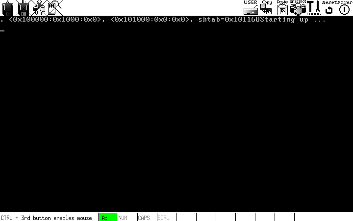

# 2. Genesis

## 2.1. 引导代码

OK，是时候编写一些代码了！ 尽管我们的内核首屈一指将用C编写，但是有些事情我们只需要使用汇编即可。 其中之一是初始启动代码。

开始了：

```assembly
;
; boot.s -- Kernel start location. Also defines multiboot header.
; Based on Bran's kernel development tutorial file start.asm
;

MBOOT_PAGE_ALIGN    equ 1<<0    ; Load kernel and modules on a page boundary
MBOOT_MEM_INFO      equ 1<<1    ; Provide your kernel with memory info
MBOOT_HEADER_MAGIC  equ 0x1BADB002 ; Multiboot Magic value
; NOTE: We do not use MBOOT_AOUT_KLUDGE. It means that GRUB does not
; pass us a symbol table.
MBOOT_HEADER_FLAGS  equ MBOOT_PAGE_ALIGN | MBOOT_MEM_INFO
MBOOT_CHECKSUM      equ -(MBOOT_HEADER_MAGIC + MBOOT_HEADER_FLAGS)


[BITS 32]                       ; All instructions should be 32-bit.

[GLOBAL mboot]                  ; Make 'mboot' accessible from C.
[EXTERN code]                   ; Start of the '.text' section.
[EXTERN bss]                    ; Start of the .bss section.
[EXTERN end]                    ; End of the last loadable section.

mboot:
  dd  MBOOT_HEADER_MAGIC        ; GRUB will search for this value on each
                                ; 4-byte boundary in your kernel file
  dd  MBOOT_HEADER_FLAGS        ; How GRUB should load your file / settings
  dd  MBOOT_CHECKSUM            ; To ensure that the above values are correct
   
  dd  mboot                     ; Location of this descriptor
  dd  code                      ; Start of kernel '.text' (code) section.
  dd  bss                       ; End of kernel '.data' section.
  dd  end                       ; End of kernel.
  dd  start                     ; Kernel entry point (initial EIP).

[GLOBAL start]                  ; Kernel entry point.
[EXTERN main]                   ; This is the entry point of our C code

start:
  push    ebx                   ; Load multiboot header location

  ; Execute the kernel:
  cli                         ; Disable interrupts.
  call main                   ; call our main() function.
  jmp $                       ; Enter an infinite loop, to stop the processor
                              ; executing whatever rubbish is in the memory
                              ; after our kernel!
```

## 2.2. 理解引导代码

该代码段中实际上只有几行代码：

```assembly
push ebx
cli
call main
jmp $
```

其余全部与multiboot header有关。

### 2.2.1 Multiboot

Multiboot是GRUB期望内核遵循的标准。这是Bootloader的一种方式

1. 确切知道内核启动时想要/需要什么环境。
2. 允许内核查询其所在的环境。

因此，例如，如果您的内核需要以特定的VESA模式进行加载（顺便说一句，这是个坏主意），您可以将此信息通知给引导加载程序，并且它可以为您解决这一问题。

为了使您的内核具有多重引导兼容性，您需要在内核中的某个位置添加头结构（实际上，头必须位于内核的前4KB中）。有用的是，有一个NASM命令可以让我们在代码中嵌入特定的常量 - `dd`。这些行：

```assembly
dd MBOOT_HEADER_MAGIC
dd MBOOT_HEADER_FLAGS
dd MBOOT_CHECKSUM
dd mboot
dd code
dd bss
dd end
dd start
```

那样做。上面定义了 `MBOOT_ *` 常量。

- MBOOT_HEADER_MAGIC
  魔术数字。这将内核标识为兼容多重引导。

- MBOOT_HEADER_FLAGS
  标志的领域。我们要求GRUB对所有内核部分进行页面对齐（MBOOT_PAGE_ALIGN），并给我们一些内存信息（MBOOT_MEM_INFO）。请注意，某些教程还使用MBOOT_AOUT_KLUDGE。由于我们使用的是ELF文件格式，因此无需进行此修改，并且在启动时添加它会停止GRUB，从而为您提供符号表。

- MBOOT_CHECKSUM
  定义此字段，以便在将魔幻数字，标志和标记加在一起时，总数必须为零。用于错误检查。

- mboot
  我们当前正在编写的结构的地址。GRUB使用它来判断我们是否期望重新定位。

- code,bss,end,start
  这些符号全部由链接器定义。我们使用它们来告诉GRUB，内核的不同部分可以位于何处。

在启动时，GRUB会将指向另一个信息结构的指针加载到EBX寄存器中。这可以用来查询为我们设置的环境GRUB。

### 2.2.2. 再次回到代码

因此，在启动时，asm代码段立即告诉CPU将EBX的内容压入堆栈（请记住，EBX现在包含一个指向多重引导信息结构的指针），禁用中断（CLI），调用我们的 "main" C函数（我们尚未定义），然后进入无限循环。

一切都很好，但是代码尚未链接。我们还没有定义 `main()`！

## 2.3. 添加一些 C 代码

连接C代码和汇编非常容易。您只需要知道使用的调用约定即可。x86上的GCC使用 `__cdecl` 调用约定：

- 函数的所有参数都在堆栈上传递。
- 参数从右向左推。
- 函数的返回值以EAX返回。

...因此函数调用：

```c
d = func(a, b, c);
```

变成汇编：

```assembly
push [c]
push [b]
push [a]
call func
mov [d], eax
```

看到没有？没有其它什么了！因此，您可以看到在上面的asm代码片段中，`push ebx` 实际上是将ebx的值作为参数传递给函数 `main()`。

### 2.3.1. C 代码

```c
// main.c -- Defines the C-code kernel entry point, calls initialisation routines.
// Made for JamesM's tutorials 

int main(struct multiboot *mboot_ptr)
{
  // All our initialisation calls will go in here.
  return 0xDEADBABA;
}
```

这是 `main()` 函数的第一个实例。如您所见，我们使它采用了一个参数-指向多重引导结构的指针。我们稍后将对其进行定义（我们实际上不需要为编译代码而定义它！）。

该函数所做的全部是返回一个常量- `0xDEADBABA`。这个常数非常不寻常，以至于当我们在一秒钟内运行该程序时，它应该会在您面前脱颖而出。

## 2.4. 编译，链接和运行

现在我们已经向项目添加了一个新文件，我们还必须将其添加到makefile中。编辑这些行：

```makefile
SOURCES=boot.o
CFLAGS=
```

修改为：

```makefile
SOURCES=boot.o main.o
CFLAGS=-nostdlib -nostdinc -fno-builtin -fno-stack-protector
```

我们必须停止GCC尝试将您的linux C库链接到我们的内核-它根本不起作用（到目前为止）。那就是那些CFLAGS的目的。

好的，您现在应该可以编译，链接和运行内核了！

```shell
cd src
make clean  # Ignore any errors here.
make
cd ..
./update_image.sh
./run_bochs.sh  # This may ask your for your root password.
```

这将启动bochs，您将看到GRUB几秒钟，然后内核将运行。实际上什么也没做，所以只会冻结，说“正在启动...”

如果打开bochsout.txt，则在底部应显示以下内容：

```
00074621500i[CPU  ] | EAX=deadbaba  EBX=0002d000  ECX=0001edd0 EDX=00000001
00074621500i[CPU  ] | ESP=00067ec8  EBP=00067ee0  ESI=00053c76 EDI=00053c77
00074621500i[CPU  ] | IOPL=0 id vip vif ac vm rf nt of df if tf sf zf af pf cf
00074621500i[CPU  ] | SEG selector     base    limit G D
00074621500i[CPU  ] | SEG sltr(index|ti|rpl)     base    limit G D
00074621500i[CPU  ] |  CS:0008( 0001| 0|  0) 00000000 000fffff 1 1
00074621500i[CPU  ] |  DS:0010( 0002| 0|  0) 00000000 000fffff 1 1
00074621500i[CPU  ] |  SS:0010( 0002| 0|  0) 00000000 000fffff 1 1
00074621500i[CPU  ] |  ES:0010( 0002| 0|  0) 00000000 000fffff 1 1
00074621500i[CPU  ] |  FS:0010( 0002| 0|  0) 00000000 000fffff 1 1
00074621500i[CPU  ] |  GS:0010( 0002| 0|  0) 00000000 000fffff 1 1
00074621500i[CPU  ] | EIP=00100027 (00100027)
00074621500i[CPU  ] | CR0=0x00000011 CR1=0 CR2=0x00000000
00074621500i[CPU  ] | CR3=0x00000000 CR4=0x00000000
00074621500i[CPU  ] >> jmp .+0xfffffffe (0x00100027) : EBFE
```

请注意，EAX的值是多少？`0xDEADBABA` - `main()` 的返回值。恭喜，您现在拥有一个兼容多引导的组件蹦床，并且准备开始在屏幕上打印！



可在此处找到本教程的[示例代码](http://www.jamesmolloy.co.uk/tutorial_html/genesis.tar)

# 原文

[http://www.jamesmolloy.co.uk/tutorial_html/2.-Genesis.html](http://www.jamesmolloy.co.uk/tutorial_html/2.-Genesis.html)

# References

[http://faculty.cs.tamu.edu/bettati/Courses/OSProjects/to-use-gdb-tools.pdf](http://faculty.cs.tamu.edu/bettati/Courses/OSProjects/to-use-gdb-tools.pdf)

[http://www.ruanyifeng.com/blog/2013/02/booting.html](http://www.ruanyifeng.com/blog/2013/02/booting.html)

[https://blog.csdn.net/furzoom/article/details/52484413](https://blog.csdn.net/furzoom/article/details/52484413)
