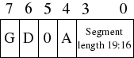

# 4. The GDT and IDT

GDT (Global Descriptor Table) 和 IDT (Interrupt Descriptor Table) 是描述符表。它们是标志和位值的数组，描述了分段系统（对于GDT）或中断向量表（IDT）的操作。

不幸的是，它们有点理论上的繁琐，但请耐心等待，因为它很快就会结束！

## 4.1. 全局描述符表（理论）

x86体系结构具有两种保护内存和提供虚拟内存的方法-分段和分页。

通过分段，将针对分段评估每个内存访问。即，将内存地址添加到段的基地址，并对照段的长度进行检查。您可以将一个段视为进入地址空间的窗口-进程不知道它是一个窗口，所看到的只是一个线性地址空间，从零开始一直到段长度。

使用分页时，地址空间被分为（通常为4KB，但这可以更改）块，称为页面。每个页面都可以映射到物理内存-映射到所谓的"frame"上。或者，可以将其unmapped。这样，您可以创建虚拟内存空间。

这两种方法都有其优点，但是分页要好得多。尽管仍然可以使用分段，但作为存储器保护和虚拟内存的一种方法，分段已迅速过时。实际上，x86-64体系结构需要平面内存模型（一个段的基数为0，限制为0xFFFFFFFF），才能使其某些指令正常运行。

但是，分段完全内置在x86体系结构中。绕开它是不可能的。因此，在这里我们将向您展示如何设置自己的全局描述符表-段描述符的列表。

如前所述，我们将尝试建立一个平面内存模型。段的窗口应从0x00000000开始并扩展到0xFFFFFFFF（内存的末尾）。但是，有一点是分段可以做到而分页无法做到的，那就是设置了ring级别。

ring是特权级别-零是最高特权，而三是最低特权。ring 0进程被称为以内核模式或主管模式运行，因为它们可以使用诸如sti和cli之类的指令，而大多数进程却不能。通常，ring 1和ring 2不使用。从技术上讲，它们可以比ring 3存取更多的超级用户模式指令子集。一些微内核体系结构使用它们来运行服务器进程或驱动程序。

段描述符内部带有一个数字，表示它适用的ring level。要更改ring level（稍后我们将做），我们需要代表ring 0和ring 3的段。

## 4.2. 全局描述符表（实践）

好吧，那是理论上的一个巨大的块，让我们进入实现这一点的实质。

我忘记提及的一件事是GRUB为您设置了GDT。问题是您不知道该GDT在哪里或其中包含什么。因此，您可能会意外覆盖它，然后您的计算机将出现三重故障并重置。Not clever.

在x86中，我们有6个分段寄存器。每个都在GDT中保留一个偏移量。它们是cs（code segment），ds（data segment），es（extra segment），fs，gs，ss（stack segment）。代码段必须引用设置为"code segment"的描述符。在access byte（访问字节）中有一个标志。其余的都应引用被设置为"data segment"的描述符。


- P: Is segment present? (1 = Yes)
- DPL: Descriptor privilege level - Ring 0 - 3.
- DT: Descriptor type
- Type: Segment type - code segment / data segment.

### 4.2.1. descriptor_tables.h

一个GDT的实体类似下面所示：

```c
// This structure contains the value of one GDT entry.
// We use the attribute 'packed' to tell GCC not to change
// any of the alignment in the structure.
struct gdt_entry_struct
{
   u16int limit_low;           // The lower 16 bits of the limit.
   u16int base_low;            // The lower 16 bits of the base.
   u8int  base_middle;         // The next 8 bits of the base.
   u8int  access;              // Access flags, determine what ring this segment can be used in.
   u8int  granularity;
   u8int  base_high;           // The last 8 bits of the base.
} __attribute__((packed));
typedef struct gdt_entry_struct gdt_entry_t;
```

这些领域大多数应该是不言自明的。Access byte（访问字节）的格式在上面已经给出，而granularity byte（粒度字节）的格式在下面给出。



- G: Granularity (0 = 1 byte, 1 = 1kbyte)
- D: Operand size (0 = 16bit, 1 = 32bit)
- 0: Should always be zero.
- A: Available for system use (always zero).

为了告诉处理器在哪里可以找到我们的GDT，我们必须为其指定特殊指针结构的地址：

```c
struct gdt_ptr_struct
{
   u16int limit;               // The upper 16 bits of all selector limits.
   u32int base;                // The address of the first gdt_entry_t struct.
} __attribute__((packed));
typedef struct gdt_ptr_struct gdt_ptr_t;
```

base是GDT中第一个entry的地址，limit是表的大小减去1（表中的最后一个有效地址）。

这些结构定义应与原型一起放在头文件descriptor_tables.h中。

```c
// Initialisation function is publicly accessible.
void init_descriptor_tables();
```

### 4.2.2. descriptor_tables.c

在descriptor_tables.c中，我们有一些声明：

```c
//
// descriptor_tables.c - Initialises the GDT and IDT, and defines the
// default ISR and IRQ handler.
// Based on code from Bran's kernel development tutorials.
// Rewritten for JamesM's kernel development tutorials.
//

#include "common.h"
#include "descriptor_tables.h"

// Lets us access our ASM functions from our C code.
extern void gdt_flush(u32int);

// Internal function prototypes.
static void init_gdt();
static void gdt_set_gate(s32int,u32int,u32int,u8int,u8int);

gdt_entry_t gdt_entries[5];
gdt_ptr_t   gdt_ptr;
idt_entry_t idt_entries[256];
idt_ptr_t   idt_ptr;
```

注意gdt_flush函数-这将在ASM文件中定义，并将为我们加载GDT指针。

```c
// Initialisation routine - zeroes all the interrupt service routines,
// initialises the GDT and IDT.
void init_descriptor_tables()
{
   // Initialise the global descriptor table.
   init_gdt();
}

static void init_gdt()
{
   gdt_ptr.limit = (sizeof(gdt_entry_t) * 5) - 1;
   gdt_ptr.base  = (u32int)&gdt_entries;

   gdt_set_gate(0, 0, 0, 0, 0);                // Null segment
   gdt_set_gate(1, 0, 0xFFFFFFFF, 0x9A, 0xCF); // Code segment
   gdt_set_gate(2, 0, 0xFFFFFFFF, 0x92, 0xCF); // Data segment
   gdt_set_gate(3, 0, 0xFFFFFFFF, 0xFA, 0xCF); // User mode code segment
   gdt_set_gate(4, 0, 0xFFFFFFFF, 0xF2, 0xCF); // User mode data segment

   gdt_flush((u32int)&gdt_ptr);
}

// Set the value of one GDT entry.
static void gdt_set_gate(s32int num, u32int base, u32int limit, u8int access, u8int gran)
{
   gdt_entries[num].base_low    = (base & 0xFFFF);
   gdt_entries[num].base_middle = (base >> 16) & 0xFF;
   gdt_entries[num].base_high   = (base >> 24) & 0xFF;

   gdt_entries[num].limit_low   = (limit & 0xFFFF);
   gdt_entries[num].granularity = (limit >> 16) & 0x0F;

   gdt_entries[num].granularity |= gran & 0xF0;
   gdt_entries[num].access      = access;
}
```

让我们分析一下代码。init_gdt首先设置了gdt指针结构，limit是每个gdt_entry_t的大小*5。为什么是5？因为我们有5个gdt_entry_t。好了，我们有一个用于内核的code和data segment描述符，一个用于用户模式的code和data segmnet描述符，以及一个空entry。这必须存在，否则会发生坏事。

然后，gdt_init通过调用gdt_set_gate来设置5个描述符。gdt_set_gate只是进行了一些复杂的旋转和移位，通过仔细地观察和阅读，这应该是不言自明的。请注意，在4个段描述符之间唯一改变的是access byte（访问字节）-0x9A，0x92、0xFA，0xF2。您可以看到，如果将这些位映射出来并与上面的格式图进行比较，则正在更改的位就是类型和DPL字段。DPL是描述符特权级别-用户code为3，内核code为0。type指定该段是code segment还是data segment（处理器会经常检查该段，并且可能会造成很多挫败感）。

- 0x9A 0b10011010 P:1, DPL:00, DT:1, Type:1010
- 0x92 0b10010010 P:1, DPL:00, DT:1, Type:0010
- 0xFA 0b11111010 P:1, DPL:11, DT:1, Type:1010
- 0xF2 0b11110010 P:1, DPL:11, DT:1, Type:0010

最后，我们有ASM函数，它将编写GDT指针。

```c
[GLOBAL gdt_flush]    ; Allows the C code to call gdt_flush().

gdt_flush:
   mov eax, [esp+4]  ; Get the pointer to the GDT, passed as a parameter.
   lgdt [eax]        ; Load the new GDT pointer

   mov ax, 0x10      ; 0x10 is the offset in the GDT to our data segment
   mov ds, ax        ; Load all data segment selectors
   mov es, ax
   mov fs, ax
   mov gs, ax
   mov ss, ax
   jmp 0x08:.flush   ; 0x08 is the offset to our code segment: Far jump!
.flush:
   ret
```

此函数采用传递给它的第一个参数（在esp+4中），将指向的值加载到GDT中（使用lgdt指令），然后加载数据段和代码段的段选择器。注意，每个GDT entry都是8个字节，内核代码描述符是第二段，因此它的偏移量是0x08。同样，内核数据描述符是第三个，因此它的偏移量是16 = 0x10。 在这里，我们将值0x10移入数据段寄存器ds，es，fd，gs，ss。更改代码段略有不同；我们必须跳远。这将隐式更改CS。

> 为什么需要远跳？
>
> 第一，Intel不允许直接修改段寄存器cs的值，我们只好这样通过这种方式更新cs段寄存器；第二，x86以后CPU所增加的指令流水线和高速缓存可能会在新的全局描述符表加载之后依旧保持之前的缓存，那么修改GDTR之后最安全的做法就是立即清空流水线和更新高速缓存。

# 原文

[http://www.jamesmolloy.co.uk/tutorial_html/4.-The%20GDT%20and%20IDT.html](http://www.jamesmolloy.co.uk/tutorial_html/4.-The%20GDT%20and%20IDT.html)

# References

[64-ia-32-architectures-software-developer-vol-3a-part-1-manual](https://www.intel.com/content/dam/www/public/us/en/documents/manuals/64-ia-32-architectures-software-developer-vol-3a-part-1-manual.pdf)
