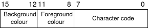

# 3. 屏幕（监视器）

因此，现在我们有了一个可以运行并将其自身陷入无限循环的“内核”，是时候在屏幕上显示一些有趣的内容了。与 serial I/O（串行I/O）一起，监视器将是您在调试战中最重要的盟友。

## 3.1. 原理

GRUB以文本模式引导您的内核。也就是说，它有一个帧缓冲区（内存区域）可用，它控制宽80高25的字符（非像素）屏幕。在进入VESA（本教程不会介绍）领域之前，这将是内核将运行的模式。

与普通RAM一样，可以访问地址为 `0xB8000` 的称为帧缓冲区的内存区域。但是，重要的是要注意，它实际上不是正常的RAM。它是VGA控制器专用视频内存的一部分，该内存已通过硬件映射到您的线性地址空间中。这是一个重要的区别。

帧缓冲器只是一个16位字的数组，每个16位值代表一个字符的显示。在位置 x，y 处指定字符的单词从帧缓冲区的开始的偏移量是：

```c
(y * 80 + x) * 2
```

需要注意的重要一点是 `*2` 只是因为每个元素的长度为2个字节（16位）。例如，如果要索引一个16位值的数组，则索引将仅为 `y * 80 + x`。

在ASCII中（文本模式不支持unicode），8位用于表示字符。这使我们再有8个未使用的位。VGA硬件使用这些来指定前景色和背景色（每个4位）。下图显示了该16位值的分割。



颜色代码的4位使我们可以显示15种可能的颜色：

0：黑色，1：蓝色，2：绿色，3：青色，4：红色，5：洋红色，6：棕色，7：浅灰色，8：深灰色，9：浅蓝色，10：浅绿色，11： 浅青色，12：浅红色，13：浅色磁石，14：浅棕色，15：白色。

VGA控制器在主 `I/O` 总线上还具有一些端口，您可以使用这些端口发送特定的指令。（除其他外）它在 `0x3D4` 有一个控制寄存器，在 `0x3D5` 有一个数据寄存器。我们将使用它们来指示控制器更新其光标位置（闪烁的下划线指示您下一个字符的位置）。

## 3.2. 实践

### 3.2.1. 第一件事

首先，我们需要一些更常用的全局功能。common.c和common.h包括用于写入和读取I/O总线的函数，以及一些typedef，这些函数使我们更容易编写可移植的代码。它们也是放置诸如memcpy/memset等功能的理想场所。我将它们留给您实现！ :)

```c
// common.h -- Defines typedefs and some global functions.
// From JamesM's kernel development tutorials.

#ifndef COMMON_H
#define COMMON_H

// Some nice typedefs, to standardise sizes across platforms.
// These typedefs are written for 32-bit X86.
typedef unsigned int   u32int;
typedef          int   s32int;
typedef unsigned short u16int;
typedef          short s16int;
typedef unsigned char  u8int;
typedef          char  s8int;

void outb(u16int port, u8int value);
u8int inb(u16int port);
u16int inw(u16int port);

#endif
```

```c
// common.c -- Defines some global functions.
// From JamesM's kernel development tutorials.

#include "common.h"

// Write a byte out to the specified port.
void outb(u16int port, u8int value)
{
    asm volatile ("outb %1, %0" : : "dN" (port), "a" (value));
}

u8int inb(u16int port)
{
   u8int ret;
   asm volatile("inb %1, %0" : "=a" (ret) : "dN" (port));
   return ret;
}

u16int inw(u16int port)
{
   u16int ret;
   asm volatile ("inw %1, %0" : "=a" (ret) : "dN" (port));
   return ret;
}
```

### 3.2.2. 屏幕（监视器）代码

一个简单的头文件：

```c
// monitor.h -- Defines the interface for monitor.h
// From JamesM's kernel development tutorials.

#ifndef MONITOR_H
#define MONITOR_H

#include "common.h"

// Write a single character out to the screen.
void monitor_put(char c);

// Clear the screen to all black.
void monitor_clear();

// Output a null-terminated ASCII string to the monitor.
void monitor_write(char *c);

#endif // MONITOR_H
```

#### 3.2.2.1. 移动光标

要移动硬件光标，首先必须计算出x，y光标坐标的线性偏移量。我们通过使用上面的方程式来做到这一点。接下来，我们必须将此偏移量发送到VGA控制器。由于某种原因，它接受16位位置作为两个字节。我们向控制器的命令端口（0x3D4）发送命令14，告诉它我们正在发送高字节，然后将该字节发送到端口0x3D5。然后，对于低字节我们重复此操作，但发送命令15。

```c
// Updates the hardware cursor.
static void move_cursor()
{
   // The screen is 80 characters wide...
   u16int cursorLocation = cursor_y * 80 + cursor_x;
   outb(0x3D4, 14);                  // Tell the VGA board we are setting the high cursor byte.
   outb(0x3D5, cursorLocation >> 8); // Send the high cursor byte.
   outb(0x3D4, 15);                  // Tell the VGA board we are setting the low cursor byte.
   outb(0x3D5, cursorLocation);      // Send the low cursor byte.
}
```

#### 3.2.2.2. 滚动屏幕

在某个时候，我们将用文本填充屏幕。如果这样做的话，屏幕就像终端一样，并向上滚动一行，那将是很好的选择。实际上，这确实不是很困难：

```c
// Scrolls the text on the screen up by one line.
static void scroll()
{

   // Get a space character with the default colour attributes.
   u8int attributeByte = (0 /*black*/ << 4) | (15 /*white*/ & 0x0F);
   u16int blank = 0x20 /* space */ | (attributeByte << 8);

   // Row 25 is the end, this means we need to scroll up
   if(cursor_y >= 25)
   {
       // Move the current text chunk that makes up the screen
       // back in the buffer by a line
       int i;
       for (i = 0*80; i < 24*80; i++)
       {
           video_memory[i] = video_memory[i+80];
       }

       // The last line should now be blank. Do this by writing
       // 80 spaces to it.
       for (i = 24*80; i < 25*80; i++)
       {
           video_memory[i] = blank;
       }
       // The cursor should now be on the last line.
       cursor_y = 24;
   }
}
```

#### 3.2.2.3. 在屏幕上写一个字符

现在，代码变得更加复杂了。但是，如果您看一下它，就会发现其中大部分是将光标放在下一个位置的逻辑-那里确实没有什么困难。

```c
// Writes a single character out to the screen.
void monitor_put(char c)
{
   // The background colour is black (0), the foreground is white (15).
   u8int backColour = 0;
   u8int foreColour = 15;

   // The attribute byte is made up of two nibbles - the lower being the
   // foreground colour, and the upper the background colour.
   u8int  attributeByte = (backColour << 4) | (foreColour & 0x0F);
   // The attribute byte is the top 8 bits of the word we have to send to the
   // VGA board.
   u16int attribute = attributeByte << 8;
   u16int *location;

   // Handle a backspace, by moving the cursor back one space
   if (c == 0x08 && cursor_x)
   {
       cursor_x--;
   }

   // Handle a tab by increasing the cursor's X, but only to a point
   // where it is divisible by 8.
   else if (c == 0x09)
   {
       cursor_x = (cursor_x+8) & ~(8-1);
   }

   // Handle carriage return
   else if (c == '\r')
   {
       cursor_x = 0;
   }

   // Handle newline by moving cursor back to left and increasing the row
   else if (c == '\n')
   {
       cursor_x = 0;
       cursor_y++;
   }
   // Handle any other printable character.
   else if(c >= ' ')
   {
       location = video_memory + (cursor_y*80 + cursor_x);
       *location = c | attribute;
       cursor_x++;
   }

   // Check if we need to insert a new line because we have reached the end
   // of the screen.
   if (cursor_x >= 80)
   {
       cursor_x = 0;
       cursor_y ++;
   }

   // Scroll the screen if needed.
   scroll();
   // Move the hardware cursor.
   move_cursor();
}
```

看到了吗？很简单！实际进行编写的位置在这里：

```c
location = video_memory + (cursor_y*80 + cursor_x);
*location = c | attribute;
```

- 将 `location` 设置为指向与当前光标位置相对应的单词的线性地址（请参见上面的公式）。
- 将 `location` 处的值设置为字符与"attribute"的逻辑或。请记住，我们将"attribute"左移了8位，因此实际上我们只是将"c"设置为"attribute"的低字节。

#### 3.2.2.4. 清屏

清除屏幕也很容易。只需填充大量的空白即可：

```c
// Clears the screen, by copying lots of spaces to the framebuffer.
void monitor_clear()
{
   // Make an attribute byte for the default colours
   u8int attributeByte = (0 /*black*/ << 4) | (15 /*white*/ & 0x0F);
   u16int blank = 0x20 /* space */ | (attributeByte << 8);

   int i;
   for (i = 0; i < 80*25; i++)
   {
       video_memory[i] = blank;
   }

   // Move the hardware cursor back to the start.
   cursor_x = 0;
   cursor_y = 0;
   move_cursor();
}
```

#### 3.2.2.5. 写一个字符串

```c
// Outputs a null-terminated ASCII string to the monitor.
void monitor_write(char *c)
{
   int i = 0;
   while (c[i])
   {
       monitor_put(c[i++]);
   }
}
```

## 3.3. 总结

如果将所有代码放在一起，则可以在 main.c 文件中添加几行：

```c
monitor_clear();
monitor_write("Hello, world!");
```

等等-文本输出功能！几分钟的工作还不错，是吗？

## 3.4. 扩展

除了实现 memcpy/memset/strlen/strcmp 等外，还有一些其他功能可以使您的生活更轻松。

```c
void monitor_write_hex(u32int n)
{
   // TODO: implement this yourself!
}

void monitor_write_dec(u32int n)
{
   // TODO: implement this yourself!
}
```

函数名称应该很容易解释-如果要检查指针的有效性，确实需要用十六进制编写。十进制是可选的，但很高兴偶尔看到以10为基数的内容！

您还可以在 linux0.1 代码上进行侦查-该代码具有 vsprintf 的实现，非常整洁。您可以复制该函数，然后使用它来实现 printf()，这将使您的生活在调试时变得更加轻松。

本教程的源代码在[这里](http://www.jamesmolloy.co.uk/tutorial_html/the_screen.tar.gz)

# 原文

[http://www.jamesmolloy.co.uk/tutorial_html/3.-The%20Screen.html](http://www.jamesmolloy.co.uk/tutorial_html/3.-The%20Screen.html)

# References

[https://wiki.osdev.org/Inline_Assembly/Examples](https://wiki.osdev.org/Inline_Assembly/Examples)

[https://www.tldp.org/HOWTO/text/IO-Port-Programming](https://www.tldp.org/HOWTO/text/IO-Port-Programming)

[https://gcc.gnu.org/onlinedocs/gcc/Extended-Asm.html](https://gcc.gnu.org/onlinedocs/gcc/Extended-Asm.html)

[https://www.ibm.com/developerworks/rational/library/inline-assembly-c-cpp-guide/index.html](https://www.ibm.com/developerworks/rational/library/inline-assembly-c-cpp-guide/index.html)

[http://wiki.0xffffff.org/posts/hurlex-4.html](http://wiki.0xffffff.org/posts/hurlex-4.html)
